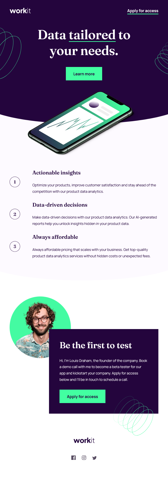

# Frontend Mentor - Workit landing page solution

This is a solution to the [Workit landing page challenge on Frontend Mentor](https://www.frontendmentor.io/challenges/workit-landing-page-2fYnyle5lu). Frontend Mentor challenges help you improve your coding skills by building realistic projects.

## Table of contents

- [Overview](#overview)
  - [The challenge](#the-challenge)
  - [Screenshot](#screenshot)
  - [Links](#links)
- [My process](#my-process)
  - [Built with](#built-with)
  - [What I learned](#what-i-learned)
  - [Useful resources](#useful-resources)
- [Author](#author)

## Overview

### The challenge

Users should be able to:

- View the optimal layout for the interface depending on their device's screen size
- See hover and focus states for all interactive elements on the page

### Screenshot

### Links

- Solution URL: [solution URL here](https://www.frontendmentor.io/solutions/responsive-landing-page-rQTYpA820z)
- Live Site URL: [live site URL here](https://cla91.github.io/workit-landing-page/)

## My process

### Built with

- Semantic HTML5 markup
- CSS custom properties
- Flexbox
- CSS Grid
- Mobile-first workflow
- CSS Container Queries

### What I learned

This project offered great practice in implementing a responsive design across various screen sizes using a mobile-first approach.

### Useful resources

- [Clamp calculator](https://www.marcbacon.com/tools/clamp-calculator/) - For calculating clamp values

## Author

- Website - [Claudia Cantiani](https://cla91.github.io/)
- Frontend Mentor - [@cla91](https://www.frontendmentor.io/profile/cla91)
- Github - [@cla91](https://github.com/cla91)
